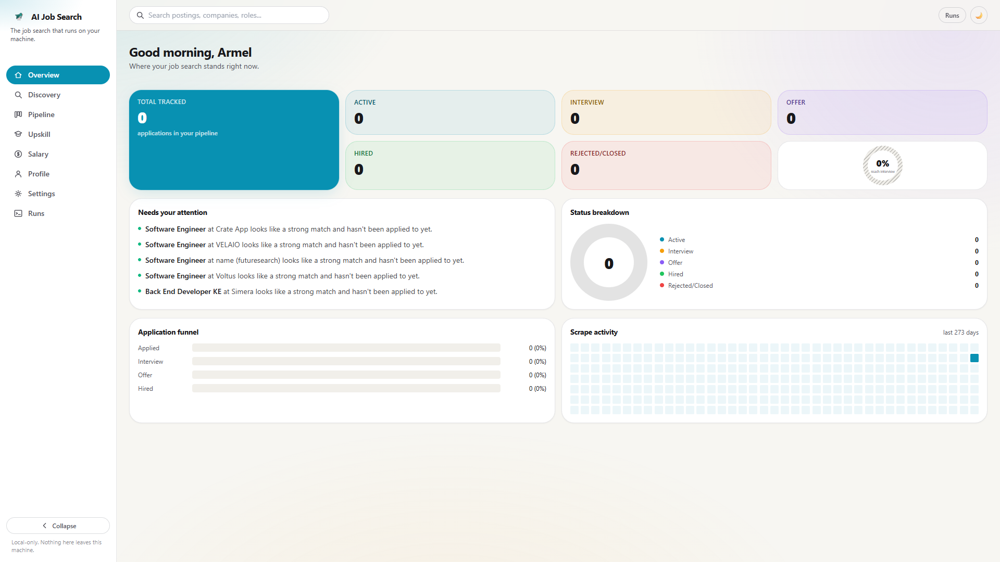
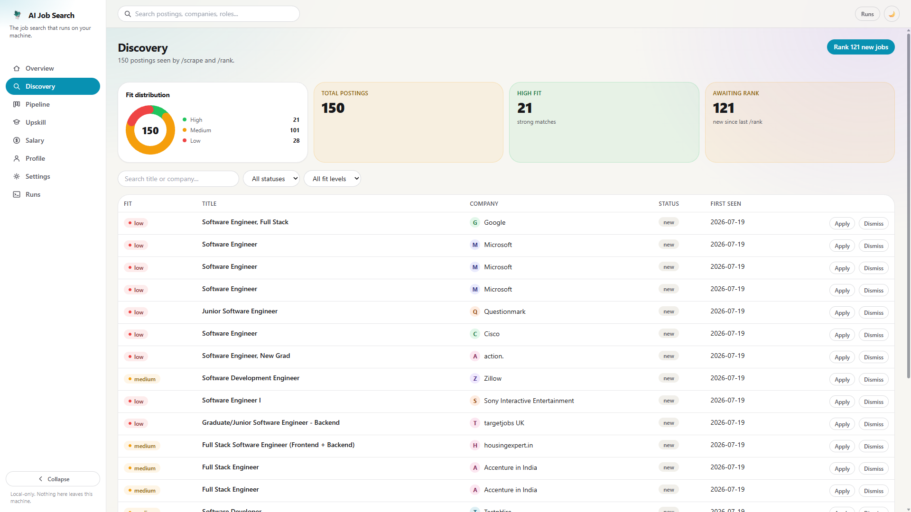
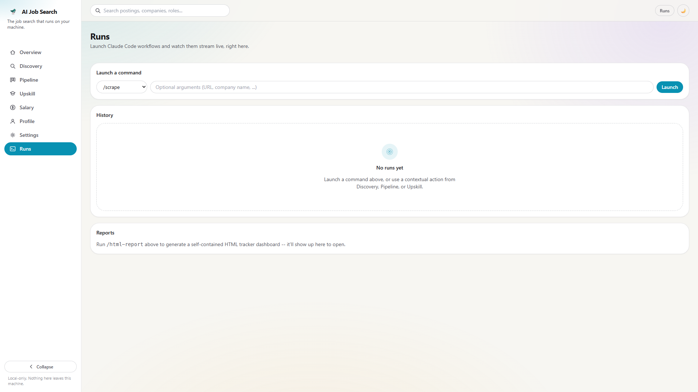
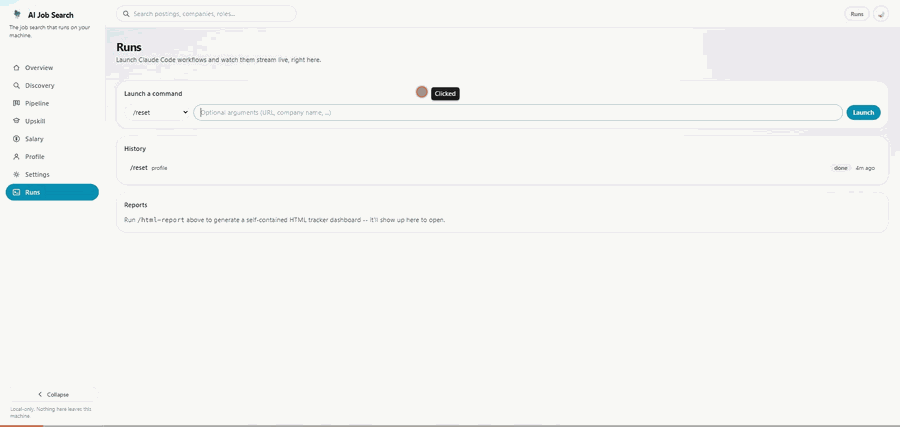

# AI Job Search Dashboard

[](https://github.com/UlrichCODJIA/ai-job-search-dashboard/actions/workflows/ci.yml)
[](LICENSE)

A local, open-source job application tracker and dashboard for [**ai-job-search**](https://github.com/MadsLorentzen/ai-job-search), a Claude powered job application framework. This isn't a fork or a reimplementation of it: it's a companion app (Bun API server + React/TypeScript client) that reads the same files the framework's own slash commands already produce (`seen_jobs.json`, `job_search_tracker.csv`, `upskill/` reports, `salary_data.json`, your profile skill files) and renders them as a proper UI, and it can launch those same commands directly and stream their output live instead of you running them one at a time in a terminal.f

> **Status**: built while using `ai-job-search` for my own daily job search. Nothing here replaces the framework's workflow files (`.claude/commands/`), this is a viewer and launcher for them.

| Overview                                        | Discovery                                         | Runs                                    |
| ----------------------------------------------- | ------------------------------------------------- | --------------------------------------- |
|  |  |  |

`/reset` pausing mid-run to ask for confirmation, replied to and resumed from the Runs page instead of a terminal (see ["The launcher"](#the-launcher) below for how):



## Why this exists

`ai-job-search` is good at the hard part, evaluating fit, drafting tailored CVs and cover letters, prepping for interviews. But day-to-day, it's a terminal tool: you run a command, read a wall of markdown, run the next one. I wanted to glance at where my pipeline stood without reopening a session, edit my profile without hunting through skill files by hand, and (once I was building it anyway) check things from my phone. This dashboard is that layer on top, built and audited as its own real project rather than a quick script.

## What it does

- **Overview** - funnel, status breakdown, a scrape-activity heatmap, what needs your attention
- **Discovery** - every scraped posting, sortable/filterable, with a "Why?" drawer showing `/rank`'s reasoning (strengths, gaps, deadline, location veto) instead of just a bare score
- **Pipeline** - your tracked applications as a five-stage board, with a drawer for the two fields (`status`, `notes`) the framework's own `/outcome` command ever updates post-creation
- **Upskill / Salary** - read views over the framework's own generated reports and benchmark data
- **Profile** - edit your candidate profile inline, section by section, no text editor; upload source documents; generate a tailored `cv/main_example.tex` from an uploaded resume, or a new cover-letter template from an example, without hand-editing LaTeX
- **Settings** - edit what `/scrape` searches for and which tool calls auto-approve, see which portal-search skills are installed
- **Runs** - launch any of the framework's slash commands and watch them stream live over a WebSocket, approve/deny tool calls as they come up, and **reply** to a command that pauses mid-run to ask a question (see below), with the resulting generated report linked directly if you ran `/html-report`

## Setup

Requires [Bun](https://bun.sh) and an existing checkout of
[`ai-job-search`](https://github.com/MadsLorentzen/ai-job-search) (a fork with
your own profile filled in, or the upstream repo itself).

```bash
git clone https://github.com/UlrichCODJIA/ai-job-search-dashboard.git ai-job-search-dashboard
cd ai-job-search-dashboard
bun install
```

This repo is a separate project from `ai-job-search` and must **never** live
inside its checkout (not as a subfolder, not nested anywhere under it) - keep
the two in separate directories. Point this dashboard at your `ai-job-search`
checkout with `AI_JOB_SEARCH_ROOT`, required every time you run it:

```bash
# bash / macOS / Linux
export AI_JOB_SEARCH_ROOT=/path/to/ai-job-search
bun run dev
```

```powershell
# Windows PowerShell
$env:AI_JOB_SEARCH_ROOT = "C:\path\to\ai-job-search"
bun run dev
```

`bun run dev` starts two processes: the API server (`server/`, port 4317) and
the Vite dev server (`web/`, port 5173, proxying `/api` and `/ws` to the API
server). Open <http://localhost:5173>.

For daily use without a dev server:

```bash
bun run build   # builds web/dist
bun run start   # serves the built SPA + API from one process, one port (4317)
```

Open <http://localhost:4317>.

Both modes are entirely local by default, the server binds `127.0.0.1` only
and nothing here makes network calls on your behalf except the Claude
runs you explicitly launch (which behave exactly like running `claude`
yourself). See "Remote access" below to reach it from another device.

## Remote access (e.g. from your phone)

The dashboard has **no login of its own** (by design, for a single local
user), anything that can reach it can view your job search data and launch
real Claude runs against your checkout. Don't expose it to the public
internet. The recommended way to reach it from another of your own devices
(a phone, away from your home network) is [Tailscale](https://tailscale.com/)
(free for personal use): it's a private mesh network, so the dashboard is
never reachable from the open internet, only from devices you've signed into
your own tailnet.

1. Install Tailscale on the machine that runs the server, and on your phone.
   Sign in to the same Tailscale account on both.
2. Build for production (the single-process mode, simpler to leave running
   than the two-process dev mode): `bun run build`
3. Find this machine's Tailscale IPv4 address: `tailscale ip -4`
4. Start the server bound to that address instead of `127.0.0.1`:

   ```bash
   # bash / macOS / Linux
   AI_JOB_SEARCH_ROOT=/path/to/ai-job-search HOST=<tailscale-ip> bun run start
   ```

   ```powershell
   # Windows PowerShell
   $env:AI_JOB_SEARCH_ROOT = "C:\path\to\ai-job-search"; $env:HOST = "<tailscale-ip>"; bun run start
   ```

5. On your phone, with the Tailscale app connected, open
   `http://<tailscale-ip>:4317` in a browser.

Notes:

- The machine has to be **on and awake** with the server running for
  this to work, Tailscale doesn't wake a sleeping machine, and neither does
  anything here. This gets you "reachable from anywhere," not "always on."
- `HOST` only takes effect if you set it; leaving it unset keeps the default
  `127.0.0.1`-only behavior.
- Anyone else you've added to the same tailnet can reach the dashboard too,
  keep it to devices you personally control unless you're comfortable sharing
  full read/launch access with whoever else is on it.

## What it reads and writes

All paths below are relative to your `ai-job-search` checkout (`AI_JOB_SEARCH_ROOT`), not to this repo.

| Data                                                    | Read                                       | Written by this UI                                                                                                                                                                                 |
| ------------------------------------------------------- | ------------------------------------------ | -------------------------------------------------------------------------------------------------------------------------------------------------------------------------------------------------- |
| `job_scraper/seen_jobs.json`                            | Discovery page                             | Dismissing a job (`status: "skipped"`) - nothing else                                                                                                                                              |
| `job_search_tracker.csv`                                | Overview, Pipeline                         | Editing a row's status/notes from the Pipeline drawer - the only two columns `/outcome` itself ever updates after row creation. Every other column is set once at creation and read-only here too. |
| `documents/applications/*/outcome.md`                   | Pipeline (interview stages, outcome notes) | never                                                                                                                                                                                              |
| `upskill/report-*.md`                                   | Upskill page                               | never                                                                                                                                                                                              |
| `salary_data.json`                                      | Salary page                                | never                                                                                                                                                                                              |
| `CLAUDE.md` + profile skill files                       | Profile page                               | Inline section edits, mirroring what `/setup` itself would write                                                                                                                                   |
| `.claude/skills/job-scraper/search-queries.md`          | Settings page                              | Full-text edit, mirroring `/setup --section search`                                                                                                                                                |
| `.claude/settings.json` permissions allowlist           | Settings page                              | Add/remove/edit auto-approved tool patterns                                                                                                                                                        |
| `.agents/skills/*/SKILL.md`                             | Settings page (Installed portals)          | never - read-only status list                                                                                                                                                                      |
| `reports/*.html`                                        | Runs page                                  | never - links to whatever `/html-report` last generated                                                                                                                                            |
| `documents/{cv,linkedin,diplomas,references,postings}/` | Profile page (Import documents)            | Uploading a file drops it in the matching subfolder, exactly like copying it there by hand before running `/setup` (Path A)                                                                        |

This dashboard's own working files (`server/.uploads/`, `server/.runs/`) live
inside this repo, not inside your `ai-job-search` checkout - both are
gitignored and ephemeral.

Everything else, drafting a CV, researching a company, recording a real
outcome, generating an upskill report, stays owned by the slash
commands, run through the **Runs** page or the contextual buttons on
Discovery/Pipeline/Upskill.

## Generate templates (Profile page)

Two small additions on top of the ai-job-search framework, not framework
features on their own:

- **CV from resume**: uploads to `documents/cv/`, then launches
  `/setup --section cv <path>` - a narrow addition to `/setup` that
  regenerates `cv/main_example.tex` from the given resume without redoing the
  rest of onboarding.
- **Cover letter template from an example**: uploads to this dashboard's own
  `server/.uploads/cover-letter-samples/` (not `documents/` - this isn't a
  profile source document, just a structural reference), then launches
  `/add-template` with a pointer to it. `/add-template` normally requires
  LaTeX source; a small addition (Step 1.5) extracts the _structure_
  from a non-LaTeX example instead and generates a fresh template from the
  stock `cover.cls`, registered the same way any other custom template is. It
  never touches `cover_letters/cover_example.tex`, which stays the generic
  structural reference `/apply` relies on.

## The launcher

The Runs page uses `@anthropic-ai/claude-agent-sdk` to spawn Claude
runs against your checkout (same `cwd`, same `.claude/commands` and
`.claude/skills`) and streams every event back over a WebSocket
(`/ws/runs/:id`).

Permissions are **not** bypassed. Claude's own default safety
classification still applies (it resolves most read-only operations - `Read`,
`Glob`, safe `Bash` - on its own, same as running `claude` in a terminal).
Anything that classification decides needs a human decision - `Write`, `Edit`,
`Bash` with side effects, `WebFetch`, subagent spawns, `AskUserQuestion`, etc. -
pauses and shows up as an **Approve / Deny** card on the Runs page instead of a
terminal prompt. An unanswered request auto-denies after 5 minutes so a closed
browser tab can never hang a run indefinitely.

`WebFetch` always relays, even when the URL matches what you typed when
starting the run: postings are untrusted input (see `ai-job-search`'s own
`SECURITY.md`), and `/rank`/`/scrape` fetch URLs sourced from files rather
than the run's arguments, so there's no safe "matches user input" shortcut to
auto-approve on.

Session IDs are tracked per company (`server/.runs/`, gitignored) so that
starting `/interview <company>` or `/outcome <company>` after an earlier
`/apply <url>` on the same company resumes that session's context instead of
starting cold.

**Replying mid-run**: several commands pause partway through to ask a
plain-text question (`/apply`'s "should I proceed with drafting?", `/reset`'s
typed confirmation, `/setup`'s interactive path). A one-shot request/response
has no way to answer that on its own - the Runs page's **Reply** box solves it
by resuming the exact same Claude session with your answer as the next
message, once the current turn settles.

## Known commands

The launcher only accepts the commands the framework ships: `/setup`,
`/scrape`, `/rank`, `/apply`, `/interview`, `/outcome`, `/upskill`,
`/html-report`, `/expand`, `/add-template`, `/add-portal`, `/reset`,
`/notion-sync`. Anything else is refused rather than passed through as an
arbitrary prompt.

## License

MIT - see [LICENSE](LICENSE). `ai-job-search` itself (the framework this
dashboard is a companion to) is a separate MIT-licensed project by
[Mads Lorentzen](https://github.com/MadsLorentzen/ai-job-search).
